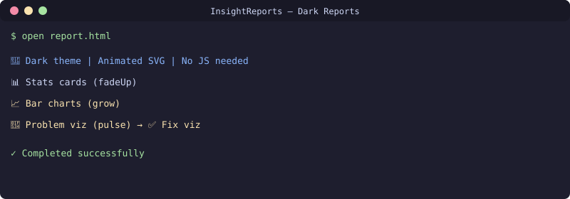

<div align="center">

**🇬🇧 [English](README.md) · 🇷🇺 [Русский](README.ru.md) · 🇺🇿 [Oʻzbekcha](README.uz.md)**

</div>

# Animated Dark-Theme Report Template
[](https://github.com/uMax-Cyber/InsightReports/actions/workflows/ci.yml)



HTML report generator with dark theme, inline SVG animations, and embedded problem visualizations. Each problem gets a "before/after" animation pair — plays in any browser, no external files needed.

## Design System

- **Palette**: bg `#0d1117`, panels `#161b22`, borders `#30363d`, text `#e6edf3`
- **Accents**: blue `#58a6ff` (info), red `#f85149` (problem), green `#3fb950` (fix), yellow `#d29922` (warning)
- **Fonts**: system stack (Segoe UI / -apple-system / sans-serif)

## Animation Types (all inline SVG with SMIL)

| Animation | CSS/SMIL | Use Case |
|-----------|----------|----------|
| fadeUp | `@keyframes` | Cards entering view |
| grow | `@keyframes` | Progress bars filling |
| pulse | `@keyframes` | Critical alerts drawing attention |
| packet-flow | `<animate x>` | Network packets traveling |
| counter | `<animate>` + JS optional | Numbers counting up |
| pool-grid | staggered `<animate opacity>` | Status grids filling in |

## Structure

```
Report
├── Header (title, date, metadata)
├── "TL;DR" verdict block (3 key phrases)
├── Stat cards (big numbers, fadeUp animation)
├── Problem sections (each with SVG animation)
│   ├── Problem description
│   ├── Animated SVG visualization ("before")
│   └── Fix section
│       └── Animated SVG visualization ("after")
├── Findings table
└── Action plan (numbered steps)
```

## Example: DHCP Pool Exhaustion (inline SVG)

The visualization shows:
- Client 📱 sending DISCOVER packets toward server
- Server 😕 (red) ignoring them when pool is full
- Pool grid: 38/40 squares red (staggered opacity animation)
- After fix: server 😀 (green), OFFER packets returning, pool 15/40

## Usage

```bash
# Copy the template, replace content
cp templates/report-template.html my-report.html
# Edit sections with your data
# Open in browser — animations play automatically
```

## License
MIT
